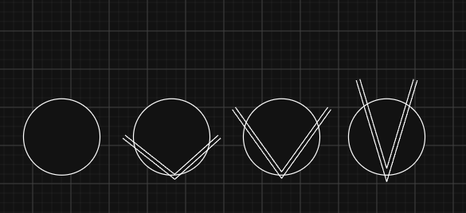
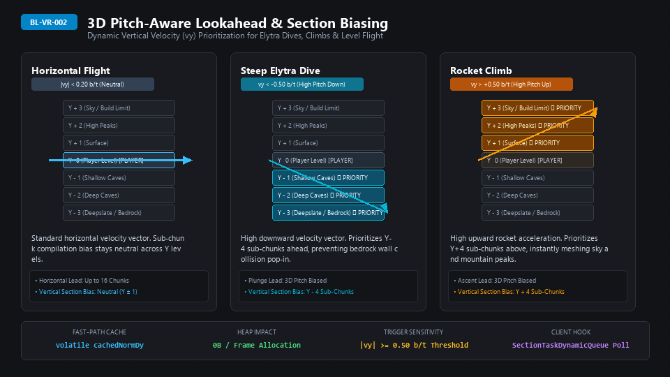

# ⚡ How Velocity Render Works: Anisotropic Velocity Prioritization

> **"Render what's ahead, not what's behind."**

---

## 🎯 The Core Concept

Vanilla Minecraft generates and meshes chunks in a uniform circular radius centered on the player. Whether you are standing still or flying at 40 m/s with an Elytra, vanilla allocates equal CPU time to terrain behind your back as it does to terrain in front of your eyes.

**Velocity Render** transforms this circular model into **dynamic, velocity-biased anisotropic prioritization**. As you accelerate, the game reorients its generation and meshing resources into a forward-facing vector cone.

---

## 📊 The Velocity Cone Progression



```
       Stage 1                   Stage 2                  Stage 3                  Stage 4
   [Standing Still]             [Walking]               [Sprinting]             [Elytra Flight]

         ┌─┐                      ┌─┐                      ┌─┐                      \  /
       ┌─┘ └─┐                  ┌─┘ └─┐                  ┌─┘ └─┐                     \/
      │   ●   │                │ \ ● / │                │ \ ● / │                    ││
       └─┐ ┌─┘                  └─┐ ┌─┘                  \ ┌─┐ /                     ││
         └─┘                      \ /                     \   /                      \●/
                                   V                        V                         V
     Vanilla Circle             Wide V                   Medium V                  Tight V
    Uniform Radius         Low Forward Bias        Balanced Priority           Max Forward Reach
```

---

## 🔬 How Each Stage Works

### Stage 1: Vanilla Circle (`Speed < 0.20 b/t` / Standing or Idling)
- **Behavior**: Pure vanilla behavior.
- **Client Meshing**: Standard Euclidean distance ($\text{dist}^2 = \Delta x^2 + \Delta y^2 + \Delta z^2$). Chunks in all directions share equal compile priority.
- **Server Tickets**: Zero forward tickets issued. Only vanilla chunk loading is active.

### Stage 2: Wide V (`Speed ~ 0.20 – 0.50 b/t` / Walking & Trotting)
- **Behavior**: Forward bias activates subtly.
- **Client Meshing**: Chunks directly ahead receive a small negative distance bias, pushing them slightly ahead of side and rear chunks in the render builder queue.
- **Server Tickets**: 1 to 4 forward chunks requested along the travel vector.

### Stage 3: Medium V (`Speed ~ 0.50 – 1.20 b/t` / Sprinting, Riding Horses, Minecarts)
- **Behavior**: Prioritization cone narrows and extends forward.
- **Client Meshing**: Forward chunks cut in front of side chunks in the compile queue. Chunks behind the player receive positive distance penalties, deprioritizing them so render threads focus purely on your path.
- **Server Tickets**: 4 to 8 forward chunks requested. Chunks left behind are immediately pruned.

### Stage 4: Tight High-Speed V (`Speed > 1.20 b/t` / Elytra Dives & Blue Ice Highways)
- **Behavior**: Maximum forward reach and narrowest lookahead corridor.
- **Client Meshing**: Forward chunks up to 16 chunks (256 meters) ahead are treated as if they were right next to the player, eliminating chunk pop-in and void stalls at high speed. Chunks behind the player are effectively ignored by the meshing thread until speed decreases.
- **Server Tickets**: Full dynamic corridor generation (up to 16 chunks in the Overworld/End, clamped to 60% / 10 chunks in the Nether).

---

## 🔄 Dynamic Banked Turn Compensation

When a player banks sharply into a turn (e.g. whipping their camera 90° or 180° during flight):

1. **Angular Rate Detection**: `TurnRateCalculator` calculates instantaneous yaw turn rate ($\Delta \text{yaw} / \Delta t$) using an Exponential Moving Average (EMA).
2. **Arc Fan-Out Expansion**: If turning is active ($\ge 4^\circ/\text{tick}$ at $\ge 0.50\text{ b/t}$), the forward corridor fans outward dynamically:
   - **Inner curve**: Expands +1 to +2 chunks deep into the apex of your turn (where your camera will face next).
   - **Outer curve**: Maintains a +1 chunk safety tangent on the outer rim.
3. **Recovery**: Once flight straightens out, the corridor immediately decays back into the narrow forward pencil line, conserving server resources.

---

## 🏔️ 3D Pitch-Aware Vertical Lookahead (Dives & Ascents)



High-speed flight rarely happens in a flat 2D plane. Steep Elytra dives, firework rocket climbs, and bubble elevator ascents traverse vertical sub-chunks ($16\times 16\times 16$ sections) at speeds exceeding vanilla's standard radial meshing:

1. **Normalized Pitch Component ($v_y$) Integration**:
   - `ClientVelocityTracker` computes normalized 3D velocity unit vector $(\hat{v}_x, \hat{v}_y, \hat{v}_z)$ every client tick.
   - When pitch angle is neutral ($|v_y| < 0.20\text{ b/t}$), compilation bias remains balanced across horizontal terrain.
2. **Steep Elytra Dives ($v_y < -0.50\text{ b/t}$)**:
   - When plunging toward the ground from build height, the 3D dot-product prioritizes sub-chunks $Y - 4$ ahead of the player's descent vector.
   - Terrain and cave roofs directly below compile and mesh before impact, eliminating terrifying bedrock void drops.
3. **Rocket Climbs & Rapid Ascents ($v_y > +0.50\text{ b/t}$)**:
   - During rocket ascents, sub-chunks $Y + 4$ above the player receive compile prioritization.
   - High mountain peaks, floating islands, and cloud layer geometry render immediately ahead of your arrival.
4. **Zero-Allocation Hot Path**:
   - `volatile double cachedNormDy` provides thread-safe, lock-free access to render threads during `SectionTaskDynamicQueue.poll()` with 0 bytes of GC heap churn.

---

## 👥 Server-Wide Multi-Player Ticket Quota Allocation


On active multiplayer servers with dozens of simultaneous explorers, unrestricted chunk ticket allocation could overwhelm worldgen worker threads:

1. **Global Server Ticket Pool (`server_ticket_budget`)**:
   - Default pool: `64` total active forward tickets server-wide.
   - Fully configurable up to `Integer.MAX_VALUE` via `/vr set budget <val>` or `velocityrender:server_ticket_budget`.
2. **Dynamic Speed-Share Proportional Partitioning**:
   - Ticket allocation evaluates active players moving $\ge 0.20\text{ b/t}$.
   - Faster players (e.g., supersonic Elytra flyers moving at $48\text{ m/s}$) receive a larger proportional share of tickets (up to 32 tickets + banked fan-out) to sustain uninterrupted flight corridors.
   - Moderate flyers receive balanced allocations (8–16 tickets).
   - Idle or walking players ($< 0.20\text{ b/t}$) draw `0` forward tickets, seamlessly falling back to vanilla radial chunk loading.
3. **Anti-Starvation Guarantees**:
   - Every active flyer is guaranteed a minimum floor of $\min(4, \text{budget} / N)$ tickets regardless of how fast other players are traveling.
4. **Overflow-Proof Saturated Math**:
   - Floor calculations utilize `long` arithmetic saturated at physical data type bounds, preventing integer wraparound or allocation freezes.

---

## 🌌 Dimension Reach Scaling & Conventional Tags


Different dimensions impose drastically different CPU generation costs. Generating 16 chunks of open Overworld sky is computationally light; generating 16 chunks of Nether terrain (with solid bedrock ceilings, complex 3D noise carvers, and dense lava oceans) is computationally demanding:

1. **Overworld (`minecraft:overworld`)**:
   - Operates at **100% reach** (up to 16 chunks / 256 meters forward lookahead).
2. **The Nether (`minecraft:the_nether`)**:
   - Clamped to **60% reach** (`velocityrender:reach_clamp_the_nether_pct = 60`).
   - Limits forward reach to 10 chunks (160 meters), saving over **40% worldgen CPU time** while providing ample reaction distance for high-speed ice-boat highways and Elytras.
3. **Dense & Modded Dimensions (`#c:dense_dimensions` / `#velocityrender:dense_dimensions`)**:
   - Automatically scaled to **80% reach** (`velocityrender:reach_clamp_default_dense_pct = 80`), yielding 13 chunks (208 meters) lookahead.
   - Datapacks and modpacks can tag heavy cave worlds, custom subterranean dimensions, or dense mining dimensions using Conventional Tags for automatic protection.
4. **Multi-Channel Control & Sparse Persistence**:
   - Dynamic GameRules: `velocityrender:reach_clamp_<dimension>_pct` auto-registered dynamically on server startup.
   - In-game tuning: `/vr dimclamp <dimension> <pct>` and `/vr dimclamp reset`.
   - Sparse Delta JSON: `config/velocity-render/dimension_clamps.json` stores only customized dimension overrides without bloated boilerplate.

---

## 🛡️ MSPT Watchdog & Performance Safeguards

- **MSPT Watchdog**: If server tick duration exceeds $25\text{ms}$ (dropping below 20 TPS), the lookahead reach automatically sheds distance and cuts outer fan-out chunks.
- **Zero-Allocation Hot Path**: Primitive sets (`LongOpenHashSet`), vector pooling, and cached references guarantee **0 bytes of GC heap allocation per frame and per tick**.
- **Fair Ticket Budget**: Multi-player servers distribute a global ticket budget fairly based on speed share, preventing any single player from starving chunk generation workers.

---

## 🔓 Freedom Over Anti-Crash: Uncapped Lookahead Scaling

Adhering to the **Freedom Over Anti-Crash Principle**, Velocity Render rejects artificial software ceilings and nanny clamps:

### 1. Uncapped Power-User Parameters
- **Forward Lead Multiplier**: Operates up to JVM capacity (`Integer.MAX_VALUE`). Power players and high-speed modpack testers (supersonic Elytras, rail cannons, ice highway racers) can push client compile prioritization hundreds of blocks ahead without artificial 48-block caps.
- **Server Ticket Budget**: Server operators can allocate large ticket pools (e.g. `256`, `1024`, `2048+`) matching their dedicated multi-core hardware, allowing active flyers to utilize 100% of the configured ticket pool.
- **Stationary Lookahead Pre-Loading**: Setting `min_speed_threshold_pct` to `0` allows forward corridors to pre-load even while standing completely still.
- **Selective Dimension Suppression**: Setting dimension clamps to `0%` allows server administrators to completely mute lookahead ticket generation in heavy or dense custom dimensions.

### 2. Dual-Sink Non-Blocking Advisory Transparency ("Warn Clearly, Never Stop")
When an operator sets extreme stress-test parameters (`> 300%` lead multiplier, `> 256` ticket budget, or `> 100%` dimension clamp):
- **Never Blocks Execution**: Commands and configuration updates execute and persist immediately to disk without aborting.
- **Dual-Sink Alerts**: Non-blocking advisory warnings are delivered directly to the player's in-game chat interface and logged as warnings in the server console (`[VelocityRender-Server] Warning: Extreme ...`).
- **Throttled Loop Tracing**: If dynamic forward reach exceeds `500` chunks during flight, a throttled diagnostic warning is emitted to the server console every 100 ticks (5 seconds).

### 3. Saturated Arithmetic & Mathematical Integrity
- **Zero NaN/Infinite Poisoning**: All vector calculations and distance biases guard against non-finite values (`Double.isNaN` / `Double.isInfinite`).
- **Dynamic Queue Sorting Stability**: The client render queue comparator protects distance delta squaring with non-negative lower bounds (`Math.max(0.0, biasedDistSqr)`), eliminating sorting crashes in `SectionTaskDynamicQueue`.
- **Overflow-Proof Ticket Quotas**: Multi-player ticket distribution uses `long` arithmetic for floor calculations and saturates quotas at physical limits (`Integer.MAX_VALUE`).

### 4. Guaranteed 100% Default Stability
Out-of-the-box defaults remain strictly identical across all environments (`lead_multiplier = 100%`, `server_ticket_budget = 64`, `min_speed_threshold = 20`, `nether_clamp = 60%`, `dense_clamp = 80%`). Standard gameplay experiences zero behavior drift.
