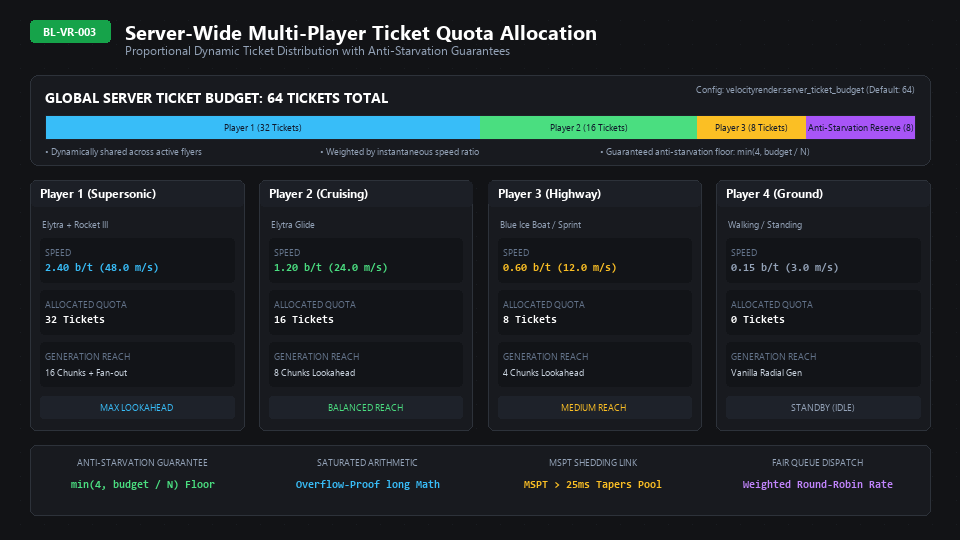
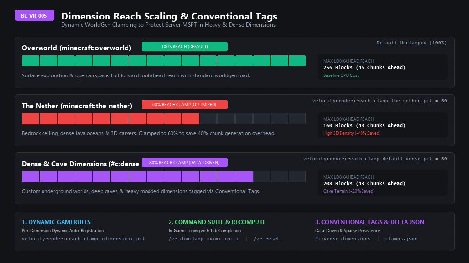

# 🌐 Server-Side Predictive Chunk Generation & Ticket Cones (MC 26.3)


> 📌 **Repository Source Disclaimer**: The documentation in this Wiki reflects the **current source code state in the repository**, which may include recent unreleased commits or developmental features ahead of public release builds on CurseForge and Modrinth.

---

## 1. Official Infobox Table

| Parameter | Technical Details |
| :--- | :--- |
| **Subsystem Name** | Predictive Chunk Generation & Ticket Cones |
| **Minecraft Anchor** | MC 26.3 |
| **Java Implementation** | `net.vanillaoutsider.velocityrender.server.ForwardTicketManager` |
| **Budget Manager** | `net.vanillaoutsider.velocityrender.server.ServerBudgetManager` |
| **Ticket Type** | `TicketType.PLAYER_LOADING` |
| **Ticket Load Radius** | Radius $1$ (Centered on projected chunk) |
| **Storage Structure** | FastUtil `LongOpenHashSet` (Zero-allocation bit-packed coordinates) |
| **Watchdog Metric** | Server MSPT via `ServerLevel.getServer().getAverageTickTimeNanos()` |
| **Controlling GameRules** | `velocityrender:enabled`, `velocityrender:budget_conservation`, `velocityrender:forward_lead_multiplier`, `velocityrender:server_ticket_budget`, `velocityrender:reach_clamp_the_nether_pct`, `velocityrender:reach_clamp_default_dense_pct` |

---

## 2. Step-by-Step Server Lifecycle & Player Workflow

```
       [ ServerTickEvents.END_SERVER_TICK ]
                        |
                        v
     [ ForwardTicketManager.tickPlayer(player) ]
                        |
   +--------------------+--------------------+
   |                                         |
(Speed < 0.20 b/t)                 (Speed >= 0.20 b/t)
   |                                         |
   v                                         v
Clear existing tickets             Check throttling triggers:
and return                         - Did player cross chunk boundary?
                                   - Did player yaw turn > 8 degrees?
                                   - Have 10 server ticks elapsed?
                                             |
                                    [ Trigger Met ]
                                             |
                                             v
                                  Evaluate Server MSPT
                                  Compute Dynamic Reach (4 - 16 chunks)
                                             |
                                             v
                                  Project Trajectory Waypoints
                                  (Add lateral fan-out if speed >= 0.80)
                                             |
                                             v
                                  Diff against activeTickets
                                  - Remove stale tickets
                                  - Add new PLAYER_LOADING tickets
```

1. **Velocity Sampling & Player Evaluation**:
   - Registered to `ServerTickEvents.END_SERVER_TICK`.
   - Each player's coordinate movement is evaluated via `VelocityCalculator`.
   - Players moving below `min_speed_threshold` ($0.20\text{ b/t}$) have all prediction tickets pruned immediately.
2. **Spatial & Angular Throttling**:
   - Recalculation occurs **only** when one of three conditions is met:
     1. Player crossed a chunk boundary (`currentChunkPacked != lastChunk`).
     2. Player rotated yaw by more than $8.0^\circ$ (`|currentYaw - lastYaw| > 8.0f`).
     3. 10 ticks have elapsed since last calculation ($0.5\text{ seconds}$).
   - This reduces ticket recalculation frequency by over $85\%$, eliminating server tick overhead.
3. **Continuous MSPT Watchdog Tapering**:
   - The server samples tick duration in nanoseconds.
   - If MSPT exceeds $25.0\text{ ms}$, lookahead reach is smoothly tapered downward to protect 20 TPS.
4. **Trajectory Waypoint Generation & Fan-Out**:
   - Waypoints are calculated in steps of 2 chunks along the horizontal unit vector.
   - At high speed ($s \ge 0.80\text{ b/t}$), banked flight lateral chunks are added to account for steering.
5. **Dimension Switch & Disconnect Safety**:
   - `ServerPlayConnectionEvents.DISCONNECT` and dimension change listeners immediately release all held tickets, preventing memory leaks and orphaned chunk generation tasks.

---

## 3. Mathematical Formulas & Ticket Dynamics

### Continuous MSPT Watchdog Scaling Factor
$$\text{mspt} = \frac{\text{averageTickTimeNanos}}{1000000.0}$$

$$\text{msptFactor} = \begin{cases} 1.0 & \text{if } \text{mspt} \le 25.0 \\ \max\left(0.25,\, 1.0 - \frac{\text{mspt} - 25.0}{25.0}\right) & \text{if } \text{mspt} > 25.0 \end{cases}$$

### Dynamic Lookahead Reach Formula
$$\text{leadScale} = \frac{\text{forwardLeadMultiplier}}{100.0}$$

$$\text{maxAllowedReach} = \max\left(4,\, \text{round}(16.0 \times \text{leadScale} \times \text{msptFactor})\right)$$

$$\text{dynamicReach} = \min\left(\text{maxAllowedReach},\, \text{round}(s \times 8.0 \times \text{leadScale} \times \text{msptFactor})\right)$$

### Trajectory Raycast Waypoints
Given player chunk coordinates $(X_{\text{player}}, Z_{\text{player}})$ and normalized horizontal velocity vector $(\hat{v}_x, \hat{v}_z)$:

$$\text{targetX}(k) = X_{\text{player}} + \text{round}(\hat{v}_x \cdot k)$$

$$\text{targetZ}(k) = Z_{\text{player}} + \text{round}(\hat{v}_z \cdot k)$$

$$\text{for } k \in \{2, 4, 6, \dots, \text{dynamicReach}\} $$

### Lateral Fan-Out Equations (For Banked Turns at High Speed)
When $s \ge 0.80\text{ b/t}$ and $k \ge 6$:

$$\text{LeftWaypoint} = \left(\text{targetX}(k) - \text{round}(\hat{v}_z),\, \text{targetZ}(k) + \text{round}(\hat{v}_x)\right)$$

$$\text{RightWaypoint} = \left(\text{targetX}(k) + \text{round}(\hat{v}_z),\, \text{targetZ}(k) - \text{round}(\hat{v}_x)\right)$$

---

## 4. Visual ASCII Diagram: Trajectory Waypoints & Fan-Out Cone

```
                                  [ REACH = 14 CHUNKS ]
                                     +---+---+---+
                                     | L | W | R |  (k = 14, Fan-Out)
                                     +---+---+---+
                                           |
                                     +---+---+---+
                                     | L | W | R |  (k = 12, Fan-Out)
                                     +---+---+---+
                                           |
                                     +---+---+---+
                                     | L | W | R |  (k = 10, Fan-Out)
                                     +---+---+---+
                                           |
                                         +---+
                                         | W |      (k = 6, Linear)
                                         +---+
                                           |
                                         +---+
                                         | W |      (k = 4, Linear)
                                         +---+
                                           |
                                         +---+
                                         | W |      (k = 2, Linear)
                                         +---+
                                           ^
                                           |  Velocity Vector (v)
                                         [ P ] (Player Chunk)
```

### Server-Wide Multi-Player Ticket Quota Allocation (BL-VR-003)



On dedicated servers hosting multiple concurrent flyers, unrestricted chunk ticket allocation could saturate generation workers:

1. **Global Server Ticket Budget (`velocityrender:server_ticket_budget`)**:
   - Default pool of `64` total active forward `PLAYER_LOADING` tickets server-wide.
   - Saturated calculation using `long` arithmetic, uncapped up to `Integer.MAX_VALUE`.
2. **Speed-Weighted Dynamic Partitioning**:
   - High-speed players (e.g. supersonic Elytra flyers moving at $48\text{ m/s}$) receive up to 32 tickets plus lateral fan-out.
   - Moderate flyers receive proportional quotas (8–16 tickets).
   - Idle/walking players ($< 0.20\text{ b/t}$) draw `0` forward tickets, falling back to standard vanilla radius loading.
3. **Anti-Starvation Guaranteed Floor**:
   - Guaranteed minimum quota of $\min(4, \text{budget} / N)$ tickets per active flyer ($s \ge 0.20\text{ b/t}$), ensuring slower travelers are never locked out of forward generation.
4. **Adaptive MSPT Watchdog Coupling**:
   - When MSPT exceeds $25\text{ ms}$, the global ticket budget dynamically contracts, shedding lateral and far-end tickets before server TPS degrades.

### Dimension Reach Scaling & Conventional Tags (BL-VR-005)



Chunk generation CPU workload varies dramatically between open surface terrain and dense enclosed subterranean dimensions:

1. **Overworld (`minecraft:overworld`)**:
   - Evaluated at **100% reach** (up to 16 chunks / 256m forward lookahead).
2. **The Nether (`minecraft:the_nether`)**:
   - Clamped to **60% reach** (`velocityrender:reach_clamp_the_nether_pct = 60`, max 10 chunks / 160m).
   - Saves **40% worldgen CPU overhead** by curtailing expensive 3D noise carvers and lava ocean calculations.
3. **Dense & Modded Dimensions (`#c:dense_dimensions` / `#velocityrender:dense_dimensions`)**:
   - Defaults to **80% reach** (`velocityrender:reach_clamp_default_dense_pct = 80`, max 13 chunks / 208m).
   - Tagged datapack dimensions automatically scale generation without manual server configuration.
4. **Command & Sparse Delta Configuration**:
   - Tune per-dimension in real time: `/vr dimclamp <dimension> <pct>` and `/vr dimclamp reset`.
   - Persisted cleanly to `config/velocity-render/dimension_clamps.json` (sparse delta JSON).

---

## 5. FastUtil Zero-Allocation Primitive Bit-Packing Schema

Coordinate pairs $(x, z)$ are packed into a single 64-bit primitive `long`:

```
Bit-Packing Format (64-bit Long):
[63 ................................... 32] [31 .................................... 0]
                 Z (32-bit signed)                          X (32-bit signed)
```

$$\text{packedPos} = ((x \,\&\, \text{0xFFFFFFFFL})) \mid (((z \,\&\, \text{0xFFFFFFFFL})) \ll 32)$$

Stored in FastUtil `LongOpenHashSet`:
- Zero heap allocation per check.
- Zero object boxing overhead (no `java.lang.Long`).
- Lock-free memory overhead footprint.

---

## 6. Exhaustive Reference Tables

| Server Metric | Range | Operational Behavior | Impact on Prediction |
| :--- | :--- | :--- | :--- |
| **MSPT $\le 25.0\text{ ms}$** | $20.0\text{ TPS}$ | Perfect server health | Full dynamic reach ($100\%$, up to 16 chunks) |
| **MSPT $25.0 - 37.5\text{ ms}$** | $20.0\text{ TPS}$ | Moderate load | Linear taper ($100\% \to 50\%$ reach) |
| **MSPT $37.5 - 50.0\text{ ms}$** | $20.0\text{ TPS}$ | Heavy load | Deep taper ($50\% \to 25\%$ reach) |
| **MSPT $> 50.0\text{ ms}$** | $< 20.0\text{ TPS}$ | Server lag detected | Emergency clamp to minimum ($4$ chunks reach) |
| **Speed $< 0.20\text{ b/t}$** | Walking | Idle state | All prediction tickets released ($0$ active) |
| **Speed $0.20 - 0.80\text{ b/t}$** | Sprinting / Horse | Linear raycast | $2$ to $8$ linear waypoints ahead |
| **Speed $\ge 0.80\text{ b/t}$** | Elytra / Ice Boat | Conical fan-out | Up to $24$ packed tickets including lateral turns |

---

## 7. Developer & API Hooks

### Public Telemetry & Status Facade
```java
// Access active player telemetry
int activeTickets = ForwardTicketManager.getActiveTicketCount(player.getUUID());
double currentSpeed = ForwardTicketManager.getPlayerSpeed(player.getUUID());
int currentReach = ForwardTicketManager.getLastDynamicReach();
float currentMspt = ForwardTicketManager.getLastServerMspt();
```

### Event Handlers
- `ForwardTicketManager.tickPlayer(ServerPlayer player)`: Called per tick per player.
- `ForwardTicketManager.onPlayerDisconnect(ServerPlayer player)`: Prunes all allocated tickets.
- `ForwardTicketManager.onPlayerChangeDimension(ServerPlayer player)`: Clears dimensional tickets.

---

## 🔗 Related Pages
- [[Anisotropic Chunk Mesh Prioritization|26.3-Anisotropic-Prioritization]]
- [[Configuration & Dynamic GameRules|26.3-Configuration-and-GameRules]]
- [[Technical Architecture & Mixins|26.3-Architecture-and-Mixins]]
